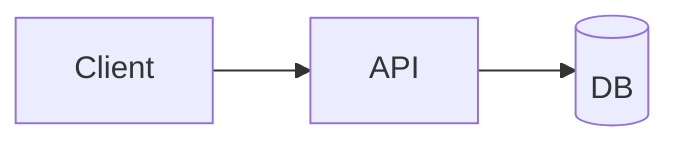

# TECH Epic Template（TECH-{{EPIC_ID}}-v{{N}}）

> 建议文件路径：
> `/docs/{{EPIC_DIR}}/tech/TECH-{{EPIC_ID}}-v{{N}}.md`
>
> 目标：把 “PRD/Story 里要做什么” 翻译成 “在现有代码基线下怎么做”，并且显式写出「复用点/改动点/迁移与上线策略/风险与任务拆解」。

---

## 0. 文档元信息

- EPIC_ID：`{{EPIC_ID}}`
- EPIC_DIR：`{{EPIC_DIR}}`
- 版本：`v{{N}}`
- 状态：`DRAFT | REVIEW | FINAL`
- 作者：`{{OWNER}}`
- 关联文档：
  - biz：`/docs/_project/biz-overview.md`
  - prd：`../prd/PRD-{{EPIC_ID}}-v{{N}}.md`
  - story：`../story/`（列出本期纳入的 Story）
  - project baseline：`/docs/_project/`（列出你依赖的基线/规范/ADR）

---

## 1. 目标与范围对齐（引用上游，不重写）

- 目标（来自 biz/prd）：`...`
- Out of Scope（来自 biz/prd）：`...`
- 验收口径摘要（来自 Story AC）：`...`
- 需求层可观测性摘要（来自 prd）：`...`

---

## 2. 现状与约束（必须先读代码）

### 2.1 相关代码/系统现状

- 相关模块/服务：`...`
- 关键入口/调用链：`...`
- 关键数据表/索引：`...`
- 关键配置/Feature Flag：`...`

### 2.2 复用清单（避免重复造轮子）

> 写清楚"能复用什么、怎么复用、为什么不复用"。
>
> ⚠️ **代码引用格式要求**：
> - ✅ 使用文件路径:行号引用（如 `src/services/UserService.ts:123-456`）
> - ❌ 禁止粘贴完整代码实现
> - ✅ 简短描述职责和关键逻辑
> - ❌ TECH 文档代码占比不应超过 30%

- 可复用能力/组件：
  - `[文件路径:行号]` - 职责描述
  - 示例：`src/services/AuthService.js:50-120` - 用户认证逻辑，包含登录、登出、token 刷新
- 需要扩展的既有能力：
  - `[文件路径:行号]` - 扩展点说明
  - 示例：`src/api/userApi.ts:200-250` - 需要增加批量用户同步接口
- 不复用的理由（如适用）：
  - 组件名称 - 不复用原因（如：架构不匹配、性能不足、维护成本高）

### 2.3 硬约束

- 技术基线约束：`...`
- 合规/权限/审计约束：`...`
- 交付约束（时间/风险/依赖）：`...`

---

## 3. 方案总览（1 页能讲清）

- 方案一句话：`...`
- 架构变化概览：`...`
- 关键 trade-off：`...`
- 影响面：`...`

（可选）架构图（Mermaid/ASCII）：

---

## 4. 详细设计

### 4.1 模块/服务边界与职责

- `...`

### 4.2 数据模型与迁移策略

- 表/字段/索引：`...`
- 迁移步骤：`...`
- 兼容策略：`...`

### 4.3 API / 事件 / 任务设计

> ⚠️ **强制要求**：所有后端 API 必须先定义接口契约，前端按契约开发。
>
> **接口契约必须包含**：
> - 请求参数（类型、格式、验证规则）
> - 响应结构（成功、失败、错误码）
> - 边界情况（空数据、权限不足等）
> - 类型定义（根据项目技术栈选择：TypeScript/Go/Java 等）
>
> **契约格式参考**：`/docs/_project/conventions/api-conventions.md`（如有）
>
> **禁止使用 mock 数据**：接口契约必须基于真实数据结构，不能用假数据。

#### API 契约模板（每个 API 必填）

**API 名称**：`{{METHOD}} {{PATH}}`

**请求契约**：
- 参数列表（根据项目技术栈定义）
- 类型定义
- 验证规则

**响应契约**：
- 成功响应结构
- 失败响应结构
- 错误码定义

**边界情况**：
- 空数据处理
- 权限不足处理
- 参数错误处理

#### API 列表（完整契约）

| API | 方法 | 路径 | 契约说明 |
|-----|------|------|----------|
| ... | ... | ... | ... |

#### 事件/消息（如有）

- 事件名称：`...`
- 事件结构：`...`
- 触发条件：`...`

#### 异步/定时任务（如有）

- 任务名称：`...`
- 触发条件：`...`
- 执行逻辑：`...`

### 4.4 安全 / 权限 / 审计

- 权限模型与校验点：`...`
- 审计日志：`...`

### 4.5 可观测性（工程侧）

> 把 prd 的需求层可观测性口径落到工程实现：日志、指标、tracing、报表管道与告警。

- 日志：`...`
- 指标：`...`
- Tracing：`...`
- 仪表盘/告警：`...`

### 4.6 失败模式与可靠性

- 幂等/重试：`...`
- 降级/兜底：`...`
- 限流/熔断：`...`

---

## 5. 上线策略（MVP→演进）

- Feature Flag / 灰度：`...`
- 回滚策略：`...`
- 数据回填/重算：`...`
- 兼容期策略：`...`

---

## 6. 风险、未决项与升级点

- `[RISK]`：`...`
- `[OPEN]`：`...`
- `[TBD]`：`...`
- 需要升级给：
  - `prd`：`...`
  - `biz-owner`：`...`
  - `proj`：`...`

---

## 7. 任务拆解建议（供 proj/dev 落 TASK）

> 输出顺序：先打通主链路，再补齐边界与质量；标出依赖关系与可以并行的项。
>
> ⚠️ **强制要求**：
> - 必须明确标注每个任务的**硬依赖**（代码必须的依赖）
> - 必须评估**并行可行性**（哪些可以独立启动）
> - **禁止使用 mock 数据**：所有集成必须用真实接口
> - 任务必须标注是否依赖其他任务的接口完成

### 7.1 任务依赖与并行可行性分析

| TASK_ID | 依赖类型 | 依赖任务 | 可并行 | 说明 |
|---------|----------|----------|--------|------|
| TASK-001 | 无 | - | ✅ | 完全独立，可立即启动 |
| TASK-002 | 硬依赖 | TASK-001 | ❌ | 代码必须调用 TASK-001 的模块 |
| TASK-003 | 接口依赖 | TASK-001 | ✅ | 按契约先行开发，类型对齐 |

**依赖类型说明**：
- **硬依赖（代码必须）**：代码直接 import 其他任务的模块，禁止 mock
- **接口依赖（联调需要）**：只需要接口契约，允许桩实现，但类型必须对齐
- **无依赖**：完全独立，可立即并行

**并行策略**：
- ✅ **第一批（立即可并行）**：无依赖 + 接口依赖的任务（契约先行）
- ⚠️ **第二批（等硬依赖）**：有硬依赖的任务，必须等待被依赖任务完成

**接口依赖的契约先行规则**：
- 可以先按接口契约开发（类型定义必须由被依赖任务提供）
- 允许使用桩实现（空实现但类型对齐）
- 必须约定接口验证时间点（被依赖任务完成后立即联调）

### 7.2 建议任务列表

- `TASK-001`：`...`（硬依赖：无 | 可并行：是）
- `TASK-002`：`...`（硬依赖：TASK-001 | 可并行：否）
- `TASK-003`：`...`

### 7.1 代码修改清单（Critical - 纵向追踪） ⭐

> **⚠️ 重要**：新增字段/功能时，必须列出所有修改点。避免遗漏（常见的遗漏点包括 Update 方法、测试用例等）。
>
> **项目特定规范**：如果项目有 `db-conventions.md` 或类似文档，请参考其中的纵向追踪规范。

**修改清单模板**（根据项目实际技术栈调整）：

#### 数据/模型层（Data/Model Layer）
- [ ] `[项目模型文件路径]` 添加字段定义
  - 示例：`src/models/User.ts` (TypeScript) 或 `internal/models/user.go` (Go)
  - 包含：数据类型、验证规则、序列化配置

#### 数据库迁移层（Migration Layer）
- [ ] `[迁移脚本路径]` 添加迁移脚本（Up/Down）
  - 示例：`migrations/V1.2.3__add_field_name.up.sql`
- [ ] 执行迁移并验证数据完整性

#### API/Handler 层（3个位置）
- [ ] `[API/Handler 文件路径]` Create 请求解析
- [ ] `[API/Handler 文件路径]` Update 请求解析
- [ ] `[API/Handler 文件路径]` 响应格式化（如需要）

#### 业务逻辑/Service 层（2个方法）← **最容易遗漏**
- [ ] `[Service 文件路径]` Create 方法保存字段
- [ ] `[Service 文件路径]` **Update 方法更新字段** ⭐

#### 测试层（端到端）
- [ ] `[测试文件路径]` Create 测试用例
- [ ] `[测试文件路径]` **Update 测试用例** ⭐
- [ ] `[测试文件路径]` 数据验证测试

#### 验证清单
- [ ] 所有层都添加了新字段的处理
- [ ] Update 方法没有遗漏
- [ ] 测试覆盖了 Create 和 Update 场景
- [ ] 迁移脚本可回滚

---

## 8. 与基线冲突（如有）

> 用 `[CONFLICT_WITH_BASELINE]` 标注，并给出 ADR 草案要点。

- `[CONFLICT_WITH_BASELINE]`：`...`
- ADR 草案要点：`...`

---

## 9. TECH 文档质量检查清单（输出前必须自检）

> **⚠️ 重要**：在输出 TECH 文档前，必须完成以下自检。

### 9.1 内容结构检查
- [ ] 是否包含架构图或流程图？（而非只有文字描述）
- [ ] 复用清单是否清晰列出了可复用组件？
- [ ] 是否明确标注了 `[ASSUMPTION]` 和 `[VERIFIED]`？
- [ ] 接口定义是否完整（请求/响应/错误码）？

### 9.2 代码占比检查（Critical）
- [ ] 代码块占比是否 < 30%？
- [ ] 所有代码是否通过文件路径引用？
- [ ] 是否避免了粘贴完整实现代码？
- [ ] API 契约和伪代码是否仅保留关键部分？

### 9.3 可落地性检查
- [ ] TASK 拆解是否可执行？（而非模糊的"优化XXX"）
- [ ] 依赖关系是否清晰？
- [ ] 风险和未决项是否显式标注？
- [ ] 迁移和回滚方案是否可行？

### 9.3.1 接口契约检查（Critical - 强制）

- [ ] 每个后端 API 都有完整的接口契约？
- [ ] 契约包含请求、响应、错误码定义？
- [ ] 边界情况都有明确定义？
- [ ] 前端可以直接按契约开发？

**如果以上任何一项不通过，禁止输出 TECH 文档。**

### 9.3.2 Mock 禁止检查（Critical - 强制）

- [ ] 是否有使用 mock 数据的计划？（如果有 = 不通过）
- [ ] 是否有使用假接口的计划？（如果有 = 不通过）
- [ ] 是否明确标注了真实接口依赖？
- [ ] 并行计划是否基于真实接口而非 mock？

**如果发现任何 mock 相关计划，禁止输出 TECH 文档。**

### 9.4 文档一致性检查
- [ ] 是否引用了上游文档（biz/prd/story）？
- [ ] 是否与项目基线保持一致？
- [ ] 术语是否与上游文档一致？

### 9.5 常见错误检查
- [ ] 是否避免了项目特定的硬编码路径？
- [ ] 是否避免了粘贴大段代码实现？
- [ ] 是否避免了假设"应该有这个字段/接口"？
- [ ] 是否所有设计决策都有代码引用来源？

**如果以上任何一项不通过，请修改文档后再输出。**
